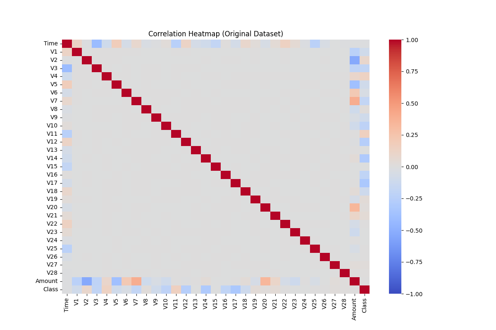
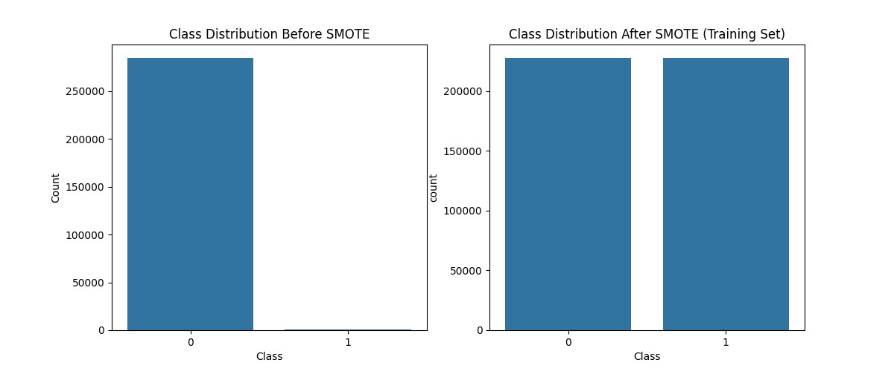
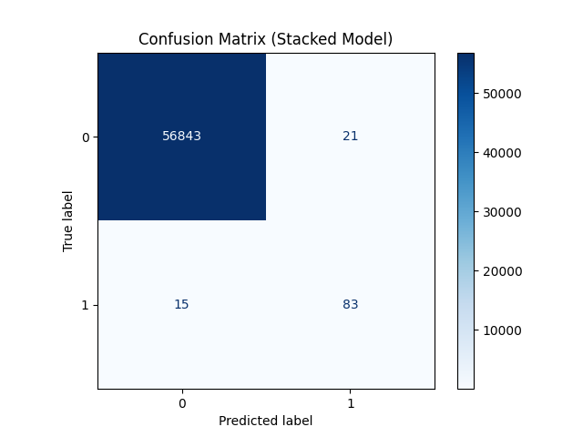
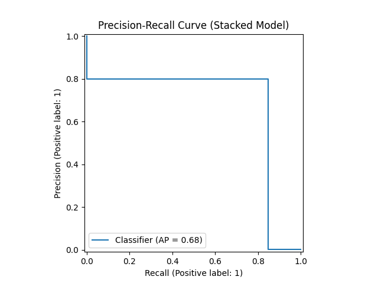
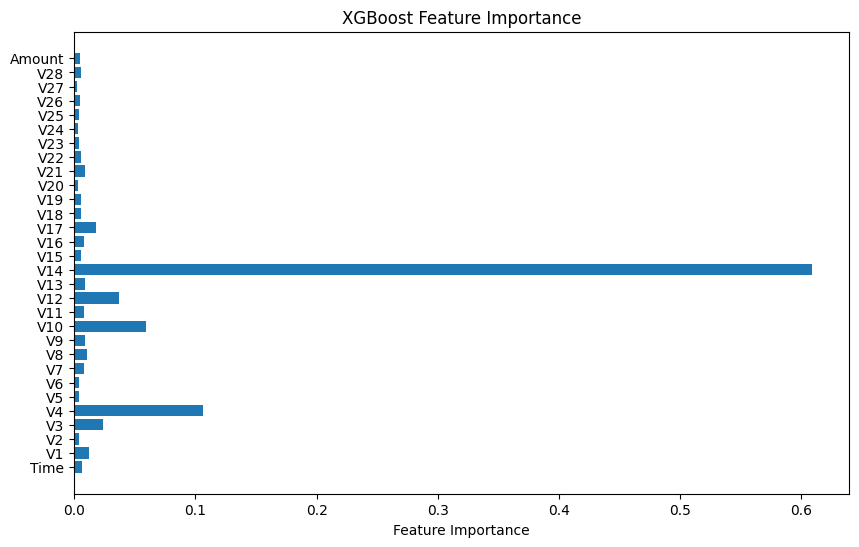
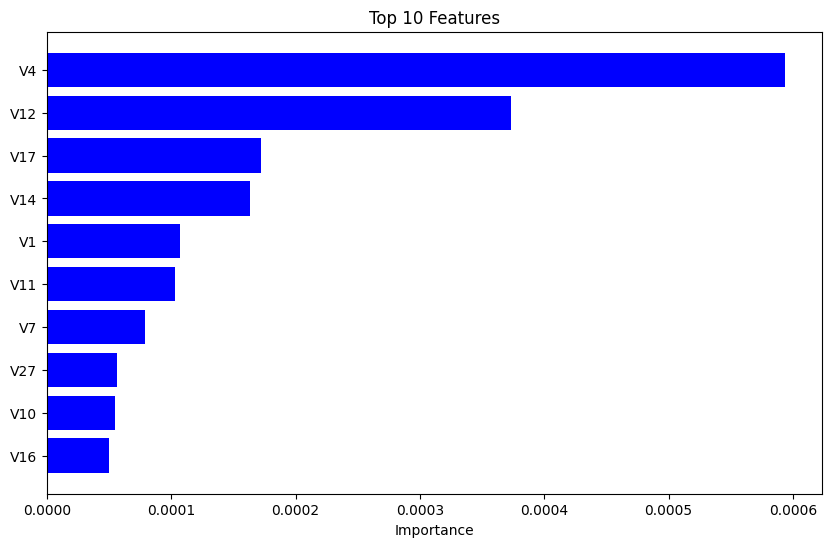

# Credit Card Fraud Detection

A machine learning project for detecting fraudulent credit card transactions using various classification algorithms.


| **Aspect** | **Details** |
|------------|-------------|
| **Best Model** | Stacked Ensemble (Random Forest + XGBoost) |
| **Performance** | 80% precision, 85% recall, 0.82 F1-Score |
| **Key Technique** | SMOTE for class imbalance handling |
| **Runtime** | Google Colab with T4 GPU |
| **Dataset Size** | 284,807 transactions (0.17% fraud) |
| **Code** | [](https://colab.research.google.com/drive/1_VJzqsPvtiJ27yMOlS-7zXhF0D3Wx7Bw) |


### 📋 Project Overview

This project analyzes credit card transaction data to build and evaluate models that can identify fraudulent activity. The dataset is highly imbalanced (only 0.17% fraud cases), presenting significant challenges for traditional classification methods.


### 🛠️ Skills & Technologies
This project demonstrates practical experience with:

| Category | Technologies & Skills |
|----------|----------------------|
| **Programming** | Python, Markdown |
| **Data Processing** | pandas, NumPy, scikit-learn (StandardScaler, train_test_split) |
| **Machine Learning** | Logistic Regression, Random Forest, XGBoost, Stacked Ensembles |
| **Imbalanced Data** | SMOTE (imbalanced-learn), precision-recall tradeoff analysis |
| **Model Evaluation** | Confusion matrices, ROC-AUC, F1-score, classification reports |
| **GPU Acceleration** | cuML, XGBoost with CUDA, Google Colab T4 GPU runtime |
| **Data Visualization** | Matplotlib, Seaborn, correlation heatmaps, feature importance plots |
| **Version Control** | GitHub, repository documentation |


### 🔑 Key Features

· Multiple Model Comparison: Logistic Regression, Random Forest, XGBoost, and Stacked Ensemble

· Class Imbalance Handling: SMOTE (Synthetic Minority Over-sampling Technique) implementation

· Performance Optimization: Precision-recall tradeoff analysis with threshold tuning

· Feature Importance Analysis: Identification of most significant fraud indicators


### 📊 Dataset

The dataset contains 284,807 transactions from European cardholders in September 2013, with 492 fraudulent transactions (0.172% of all transactions). Features include:

· Time: Seconds elapsed between each transaction and the first transaction
· Amount: Transaction amount
· V1-V28: Principal components obtained from PCA (anonymized features)
· Class: Target variable (1 = fraud, 0 = legitimate)

### 🛠️ Methodology


### 1. Data Preprocessing

· Memory optimization with data type conversion
· Feature scaling for Time and Amount using StandardScaler
· Train-test split (80-20) with stratification

### 2. Handling Class Imbalance

· Applied SMOTE to the training set only (prevents data leakage)
· Created balanced training data while maintaining original test distribution

### 3. Model Implementation

Models Evaluated:

· Logistic Regression: Baseline linear model with L2 regularization

· Random Forest: Ensemble of 200 decision trees (GPU-accelerated with cuML)

· XGBoost: Gradient boosting with hyperparameter tuning via RandomizedSearchCV

· Stacked Ensemble: Combination of Random Forest and XGBoost predictions with Logistic Regression as meta-classifier

### 4. Performance Metrics

· Precision and Recall (primary focus for fraud detection)
· F1-Score (balance between precision and recall)
· ROC-AUC Score
· Confusion Matrix analysis

### 📈 Results

### Model Performance Comparison

| Model | Fraud Precision | Fraud Recall | Fraud F1-Score | ROC-AUC |
|-------|----------------|--------------|----------------|---------|
| Logistic Regression (Threshold=0.99) | 0.64 | 0.85 | 0.73 | - |
| Random Forest | 0.68 | 0.86 | 0.76 | 0.928 |
| XGBoost (Tuned) | 0.75 | 0.86 | 0.80 | 0.958 |
| Stacked Model | **0.80** | **0.85** | **0.82** | 0.923 |

### 📊 Visual Results

**Data Exploration:**

*Feature correlation analysis showing no strong linear relationships*

**Class Distribution:**

*Left: Original imbalanced data (0.17% fraud). Right: After SMOTE resampling*

**Model Performance:**

*Confusion matrix for the stacked model (80% precision, 85% recall)*


*Precision-recall tradeoff analysis*

**Feature Importance:**


*Top features identified by XGBoost (left) and Random Forest (right)*

### Key Findings

1. Feature Importance: PCA components V4, V14, and V12 were most significant for fraud detection
2. Threshold Impact: Adjusting Logistic Regression threshold from 0.5 to 0.99 improved precision from 0.14 to 0.64 while maintaining good recall
3. Ensemble Advantage: The stacked model achieved the best precision (80%) while maintaining high recall (85%)
4. Imbalance Challenge: All models struggled with precision due to extreme class imbalance

### 🚀 How to Run

### Prerequisites

· Python 3.8+
· Google Colab or Jupyter Notebook environment

### 🖥️ Runtime & Hardware

This project was developed and tested in **Google Colab** using the **T4 GPU** runtime. GPU acceleration is required for:
- Training the `cuml` Random Forest classifier
- Running the optimized `xgboost` classifier with `device='cuda'`

To replicate the exact environment in Colab:  
**Runtime → Change runtime type → Hardware Accelerator → T4 GPU**

### Installation

1. Clone this repository:

```bash
git clone https://github.com/yourusername/credit-card-fraud-detection.git
cd credit-card-fraud-detection
```

2. Install required dependencies:

```bash
pip install -r requirements.txt
```

### Running the Analysis

Open and run the notebook credit_card_fraud_detection.py in Google Colab or Jupyter Notebook.

For Colab users, click the link below to open directly in Colab:
[](https://colab.research.google.com/drive/1_VJzqsPvtiJ27yMOlS-7zXhF0D3Wx7Bw?usp=sharing)

### 📁 Repository Structure

```
credit-card-fraud-detection/
├── credit_card_fraud_detection.py  # Main analysis script
├── README.md                          # Project documentation (this file)
├── requirements.txt                   # Python dependencies
└── assets/                            # Generated visualizations
      ├── correlation_heatmap.png
      ├── amount_distribution.png
      ├── class_distribution.png
      ├── confusion_matrix_stacked.png
      ├── precision_recall_curve.png
      ├── xgboost_feature_importance.png
      └── rf_feature_importance.png
```

### 🔮 Next Steps

Potential improvements for future work:

1. Additional Data: Collect more fraud samples to improve model performance
2. Feature Engineering: Create transaction frequency/velocity features
3. Advanced Models: Experiment with deep learning or anomaly detection approaches
4. Real-time Testing: Deploy model in simulated real-time fraud detection system
5. Cost-sensitive Learning: Incorporate financial costs of false positives/negatives

### 📚 References

· Dataset: Credit Card Fraud Detection on Kaggle
· SMOTE: Chawla, N.V. et al. (2002). "SMOTE: Synthetic Minority Over-sampling Technique"
· XGBoost: Chen, T. and Guestrin, C. (2016). "XGBoost: A Scalable Tree Boosting System"

### 📄 License

This project is available under the MIT License. See the LICENSE file for more details.

---

Note: This is a demonstration project for educational purposes. The models and techniques shown here should be adapted and validated for production use in financial systems.

This README provides a comprehensive overview while directing users to the notebook for the actual analysis. The badge link to Colab makes it easy to run the code interactively.
